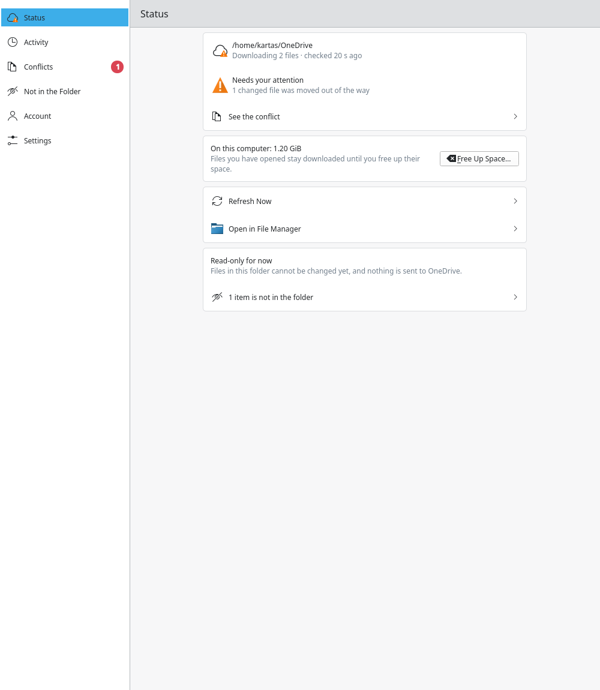
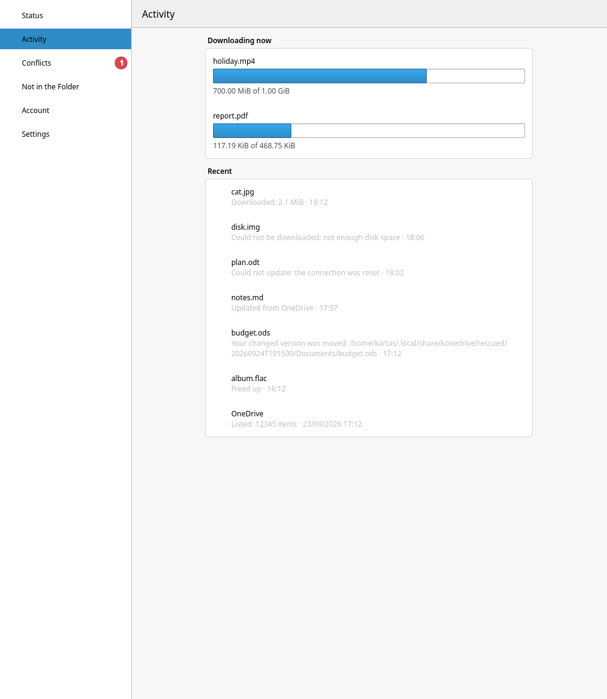
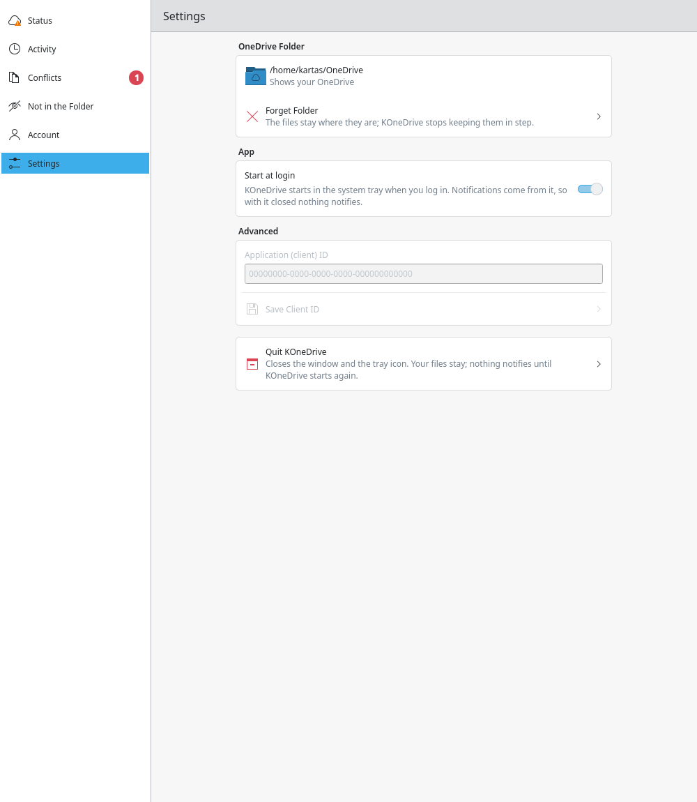

# KOneDrive

KOneDrive is a OneDrive client for KDE Plasma on Linux. It reproduces Windows' "Files
On-Demand" without FUSE: your OneDrive appears as a folder of real files at their real sizes,
each one an empty sparse placeholder until something opens it, at which point it downloads
transparently. A small root-owned helper does the interception; an unprivileged daemon does
everything else; a Qt/Kirigami window and tray icon show what is going on; Dolphin plugins add
emblems and a right-click menu.

**Status: alpha, read-only phase.** Nothing is uploaded — files in the KOneDrive folder are
`r--r--r--`, directories `r-xr-xr-x`, so nothing here can diverge from the cloud on its own.
A local edit forced past that lock is rescued (moved aside, listed under **Conflicts**), never
silently overwritten or lost. Built and tested on Fedora with KDE Plasma 6; one Microsoft
account at a time.

## Screenshots

| Status | Activity | Settings |
| --- | --- | --- |
|  |  |  |

(Shown with example data from a test daemon, not a real OneDrive account.)

## How it works

```
   fanotify pre-content events                  D-Bus (org.konedrive.*)
┌───────────────────┐   permission events   ┌───────────────┐   status, actions   ┌──────────┐
│ konedrive-helper   │ ───────────────────► │ konedrived     │ ──────────────────► │ KOneDrive│
│ (root, tiny)       │ ◄─────────────────── │ (your user)    │ ◄────────────────── │ window   │
└───────────────────┘    fill/allow/deny    └───────────────┘                     └──────────┘
```

Three processes, each with the least power it can get away with:

- **The helper** (`konedrive-helper`) is the only part that runs as root, and it is kept
  deliberately small. Intercepting an open *before* its content is read — so a program never
  sees zeros where a real file should be — needs the kernel's fanotify **pre-content** events
  (`FAN_CLASS_PRE_CONTENT`), and setting up that kind of event group needs `CAP_SYS_ADMIN`. The
  helper marks directories, tells the kernel which opens to suspend, and hands each suspended
  open to the daemon over a local socket; it makes no network connections itself
  (`PrivateNetwork=yes` in its systemd unit) and holds no OneDrive credentials.
- **The daemon** (`konedrived`) runs as your own user with no elevated privileges. It talks to
  Microsoft Graph, keeps the local SQLite index, fills a placeholder when the helper asks, and
  drives the D-Bus API the window and `konedrivectl` use.
- **The window** (`konedrive`) is a Qt/Kirigami app with a tray icon. It only ever talks to the
  daemon over D-Bus — closing it does not stop syncing.

Every feature also has a `konedrivectl` command, so nothing here depends on clicking through the
UI (see `konedrivectl --help`).

## Requirements

- **Kernel:** fanotify permission events on directories with the `FAN_MARK_IGNORE` /
  `FAN_MARK_IGNORED_SURV_MODIFY` / `FAN_MARK_EVICTABLE` combination this project relies on need
  Linux 6.0. Telling a program *why* a download failed (`ENOSPC`, `EIO`, … through `FAN_DENY`
  with an errno) needs Linux 6.14; on older kernels the helper falls back to a plain deny, so the
  program sees `EPERM`. Only 7.2.5 and 7.2.7 (Fedora 44) were measured and exercised; older
  kernels are untested. See `docs/kernel-behavior-7.2.md` for what was actually tested and on
  which filesystems (Btrfs, ext4, XFS).
- **Desktop:** KDE Plasma 6, Qt 6.8+, KDE Frameworks (KF6) 6.8+.
- **Toolchain:** a stable Rust toolchain (edition 2021), CMake 3.24+ and Extra CMake Modules.
- **A Microsoft Entra app registration** (a "client ID") — free, and yours alone; see
  "Registering the application" below.

## Build dependencies (Fedora)

```
sudo dnf install rust cargo cmake extra-cmake-modules gcc-c++ qt6-qtbase-devel \
  qt6-qtdeclarative-devel kf6-kirigami-devel kf6-kirigami-addons-devel kf6-ki18n-devel \
  kf6-kcoreaddons-devel kf6-kconfig-devel kf6-knotifications-devel \
  kf6-kstatusnotifieritem-devel kf6-kdbusaddons-devel kf6-kio-devel kf6-kwindowsystem-devel \
  kf6-kjobwidgets-devel dbus-daemon desktop-file-utils
```

These are what `app/CMakeLists.txt` and `dolphin/CMakeLists.txt` look for.

## Registering the application (once)

Microsoft only lets programs sign in with an application (client) ID. Each user registers
their own; it is free.

1. Sign in to <https://entra.microsoft.com> with an account that has a directory. An existing
   Azure account works. Otherwise create a free Azure account at <https://azure.microsoft.com/free>;
   it asks for a bank card and a phone number to verify your identity and charges nothing unless
   you upgrade.
2. Open **App registrations → New registration**.
   - Name: `KOneDrive`
   - Supported account types: **Personal Microsoft accounts only**
   - Redirect URI: platform **Public client/native (mobile & desktop)**, value `http://localhost`
3. Copy the **Application (client) ID**.

No API permissions need to be configured; KOneDrive asks for them when you sign in. The consent
screen will call the app "unverified" — expected for a personal registration. The account that
registers the app and the OneDrive account you sign in with can be different.

## Install from RPM

On Fedora, KOneDrive installs as two packages, built from this repository on your own machine
(there is no package repository yet):

- `konedrive` — the daemon, `konedrivectl`, the KOneDrive window, and the helper with its system
  service, which is enabled and started when the package is installed;
- `konedrive-kde` — the Dolphin plugins (see "Dolphin integration"). `konedrive` recommends it,
  so `dnf` installs it too; `sudo dnf remove konedrive-kde` removes it alone.

Build them as yourself, never as root. `rpm-build` and the build dependencies are needed once
(`builddep` installs whatever of the list above, and of the spec's, is missing):

```
sudo dnf install rpm-build
sudo dnf builddep packaging/rpm/konedrive.spec
scripts/build-rpm.sh
```

`scripts/build-rpm.sh` packages the committed tree (`HEAD`: uncommitted changes are left out),
with its Rust crates vendored so that the build itself is offline. Everything it makes is under
`target/rpm/`, and it lists the RPMs at the end. Then, from the repository:

```
sudo dnf install ./target/rpm/RPMS/x86_64/konedrive-0.1.0-1.fc44.x86_64.rpm \
                 ./target/rpm/RPMS/x86_64/konedrive-kde-0.1.0-1.fc44.x86_64.rpm
```

If the developer install below is on this machine, remove it first: see "Switching from the
developer install". After the install, open **KOneDrive** from the launcher. The daemon connects
to the helper within half a minute; `konedrivectl sync status` then says `Helper: connected`.

- **Upgrading** is the same `dnf install` with the newer RPMs. It restarts the helper when it
  finishes, and a program waiting for a file to download at that moment reads it as zeros
  (`docs/limitations-and-workarounds.md`, Z1 and R1): close programs that are opening files in
  the sync folder first. `dnf` treats a rebuild with the same version and release as the package
  already installed; install such a rebuild with `sudo dnf reinstall` and the same paths.
- **Removing:** run `konedrivectl sync forget` first, then `sudo dnf remove konedrive
  konedrive-kde`. Removing the package stops the helper, and a folder still registered then reads
  as zeros where its files are not downloaded (R3).

What goes where, and why: [`docs/design/packaging.md`](docs/design/packaging.md).

## Switching from the developer install

The developer install (`scripts/dev-install.sh` and `scripts/install-helper.sh`) and the packages
must not be installed together. The developer install's files take precedence over the
package's: the daemon's unit in `~/.config`, its D-Bus activation file and programs in
`~/.local`, and the helper's unit in `/etc/systemd/system`, which would keep the old helper
running instead of the packaged one (R2). Build the RPMs first, then, from the repository:

```
scripts/dev-uninstall.sh
sudo scripts/install-helper.sh --uninstall --force
sudo dnf install ./target/rpm/RPMS/x86_64/konedrive-0.1.0-1.fc44.x86_64.rpm \
                 ./target/rpm/RPMS/x86_64/konedrive-kde-0.1.0-1.fc44.x86_64.rpm
```

1. `scripts/dev-uninstall.sh` runs as you. It stops the daemon, removes exactly the files
   `scripts/dev-install.sh` installed, and reloads your systemd and D-Bus. It never touches your
   settings (`~/.config/konedrive/config.toml`), the tree store, the refresh token in KWallet or
   the sync folder, so the packaged daemon carries on from where this one stopped. It points
   "Start at login" at `/usr/bin/konedrive`, and it points out Dolphin plugins you installed for
   your user by hand: remove those, and `~/.config/plasma-workspace/env/konedrive-dolphin.sh`,
   as "Dolphin integration" says, so that Dolphin loads the packaged ones.
2. `--force`, because your folder is registered: it stays registered, and the packaged helper
   takes it over when it starts. Until then nothing intercepts the folder, so run the three
   commands one after the other, with nothing opening files in the folder.
3. The install starts the new helper. If the KOneDrive window was running, quit it from its tray
   icon and start it again from the launcher.

## Install for your user (developers)

```
scripts/dev-install.sh
```

This installs `konedrived`, `konedrivectl` and `konedrive` into `~/.local/bin`, the systemd
user unit, the D-Bus activation file and the launcher entry. The daemon starts on demand. The
helper is installed separately ("Installing the helper", below). `scripts/dev-uninstall.sh`
removes it all again, apart from the helper.

## Using your OneDrive

- **Sign in.** Open **KOneDrive** from the launcher (or `konedrive` from a terminal), enter the
  client ID under **Advanced**, and press **Sign In to OneDrive**. Or from a terminal:

  ```
  konedrivectl set-client-id 00000000-0000-0000-0000-000000000000
  konedrivectl login
  konedrivectl status
  konedrivectl logout
  ```

- **The window.** A sidebar on the left switches between six pages: **Status** (the folder, its
  item count, "Free Up Space…", "Refresh Now", "Open in File Manager"), **Activity** (downloads
  under way now, and the most recent of what the daemon keeps), **Conflicts** (local edits
  rescued out of the way, with a count badge), **Not in the Folder** (what OneDrive has that was
  skipped, and why), **Account** (sign in/out, quota) and **Settings** (the folder, "Start at
  login", "Show download progress" — a download that takes more than 2 s shows in Plasma's
  notifications — and the client ID). While the helper is not connected, a card says so, with
  the same instruction as the `Helper:` line of `konedrivectl sync status` (below). A tray icon
  mirrors the folder's state — synced, syncing, needs attention, signed out — and keeps
  KOneDrive running in the background so notifications still reach you with the window closed;
  "Start at login" is on by default after the first run. While a folder is registered, it also
  gets a "OneDrive" entry in Dolphin's Places panel and in file dialogs ("Show in Places" in
  Settings, on by default).

- **The helper.** A small privileged service that makes a placeholder download the moment a
  program opens it, instead of that program reading zeros. The `konedrive` package installs and
  starts it; with the developer install, install it with `sudo scripts/install-helper.sh` (see
  "Installing the helper" below; see also SECURITY.md for what runs as root and why). Your OneDrive folder needs it: the folder is kept in step with
  OneDrive only while the helper is connected. `konedrivectl sync status` has a `Helper:` line:
  - `connected` — files download when opened;
  - `not-installed` — no konedrive-helper service on this system: install it
    (`sudo scripts/install-helper.sh`);
  - `stopped` — installed, not running: `sudo systemctl start konedrive-helper`;
  - `failed` — the service failed: `systemctl status konedrive-helper` says why;
  - `unknown` — systemd cannot be asked, or the helper is running but the
    daemon has no link to it yet (the first few seconds after it starts).

- **Registering a folder.** `konedrivectl sync register <path>`, with the helper connected. Right
  after the helper is installed or started, the daemon takes up to half a minute to connect to
  it, and `register` is refused (`NoHelper`) until then: wait for `Helper: connected`.

- **From the command line:**
  - `konedrivectl sync status` — the folder, its phase and item count, and the helper.
  - `konedrivectl sync activity [--limit N]` — what happened lately: downloads, free-ups,
    changes from OneDrive, conflicts, failures.
  - `konedrivectl sync transfers` — downloads under way right now.
  - `konedrivectl sync conflicts` — local edits rescued out of the way; `konedrivectl sync
    dismiss <path>` takes one off the list (the file itself stays where it was moved to).
  - `konedrivectl sync free-up-space` — send every downloaded file that is not in use back to
    online-only.
  - `konedrivectl sync skipped` — what OneDrive has that did not make it into the folder, and
    why (the Personal Vault, a shared folder, a OneNote notebook, a name too long for Linux).
  - `konedrivectl sync refresh` — ask OneDrive for changes now, instead of waiting for the next
    poll (about a minute).
  - `konedrivectl sync hydrate <path>` — download one file now.

- **Read-only, for now.** This part of KOneDrive only reads from OneDrive: files are
  `r--r--r--`, directories `r-xr-xr-x`, so nothing here can diverge from the cloud on its own. A
  local edit forced past that lock is rescued, not lost — moved aside and listed under
  **Conflicts** rather than overwritten.

- **Forget.** `konedrivectl sync forget` unbinds the folder and takes the read-only lock off it;
  the files themselves are left exactly as they are.

## A folder without OneDrive or the helper (developers only)

This is a developer's and tester's mode, not a way to use KOneDrive: the window does not offer it.
It drives the sync folder entirely from the command line, with a local directory standing in for
the cloud and no helper at all.

`konedrivectl sync register-without-interception` always makes a local folder, filled with
`populate-from` — even when you are signed in, it never shows your OneDrive (that needs
`konedrivectl sync register` and the helper). And it has a real cost that the name is meant to
make obvious: **nothing** fills a placeholder when something opens it. A file in this folder reads
as zeros — not an error, not a missing file, silently the wrong bytes — until you fetch it
yourself with `konedrivectl sync hydrate`. `konedrivectl sync status` keeps repeating that warning
for as long as the folder stays registered this way. On a machine where a helper *is* running,
freeing a file up here still asks it to clear the file's mark first, and is refused (`NoHelper`)
while the daemon is not connected to it; with no helper at all, as below, nothing is asked.

```
mkdir -p ~/OneDrive-test ~/fake-cloud/sub
head -c 1M </dev/urandom > ~/fake-cloud/big.bin
echo hello > ~/fake-cloud/sub/note.txt

konedrivectl sync register-without-interception ~/OneDrive-test
konedrivectl sync populate-from ~/fake-cloud
ls -l ~/OneDrive-test        # real sizes
du -sh ~/OneDrive-test       # ~0: nothing is stored yet
cat ~/OneDrive-test/sub/note.txt                        # reads as zeros: nothing fills it here
konedrivectl sync hydrate ~/OneDrive-test/sub/note.txt
cat ~/OneDrive-test/sub/note.txt                        # now "hello"
konedrivectl sync state ~/OneDrive-test/sub/note.txt    # hydrated
konedrivectl sync dehydrate ~/OneDrive-test/sub/note.txt
du -sh ~/OneDrive-test       # ~0 again
konedrivectl sync forget
```

`konedrivectl sync status` always says something useful, including with no
helper installed at all: `State: none` and `Folder: (none)` before anything
is registered; `no-interception` for the mode above, with an `Opens:` line
saying in plain words that a file that is not downloaded reads as zeros until
you hydrate it — every time, success or not; `ready` once a folder is bound
with the real helper intercepting it (`Opens: intercepted`); or `error`
with a `Last error:` line explaining what needs attention (for example, if
startup recovery could not finish, or a OneDrive folder is waiting for the
helper). Its `Helper:` line says what the daemon knows of the helper, with
what to do about it. `error` is never printed to look like a
success — and neither is `register`/`register-without-interception`
themselves: either command exits non-zero, without its usual "Folder
registered" line, if the root it just bound was not fully recovered.

When the daemon refuses a command, `konedrivectl` says what that means for
your file and what to do next — for example, that a file you changed here
and has not been uploaded cannot be freed up without losing your edits —
rather than repeating the daemon's D-Bus error. It tells the refusals apart
by their D-Bus error names (`org.konedrive.Error.ModifiedLocally`,
`.NotHydrated`, `.NoHelper`, …), which is also what a script should match on.

## Installing the helper

The helper is the privileged part of the sync folder: a small systemd service
that makes a placeholder download the moment a program opens it, instead of
that program reading zeros. The `konedrive` package installs it
(`/usr/libexec/konedrive-helper`) and starts it; this section is for the
developer install. Build it as yourself, then install it as root:

```
cargo build --release -p konedrive-helper
sudo scripts/install-helper.sh
```

`scripts/install-helper.sh` copies the built binary to
`/usr/local/libexec/konedrive-helper` and the unit in
`packaging/systemd/konedrive-helper.service` to `/etc/systemd/system/`, then
reloads systemd, enables the service and starts (or restarts) it. It refuses
to run as a plain user. It refuses a binary that is missing, a symlink or not
a regular file, built with the VM suite's fault-injection hooks, or older than
its sources (the Rust files of the helper and the two crates it uses, and the
helper's `Cargo.toml`). It checks one root-owned copy of the binary and
installs that same copy. It always says exactly what it is about to do and
asks before doing it — pass `--yes` to skip the question. Running it again
updates the helper in place; if it is already running, the installer restarts
it and says so before it asks (see `docs/limitations-and-workarounds.md`, Z1:
a program waiting for a file to download at that moment gets it as empty).

If it says the binary is older than its sources right after a build, cargo
had nothing to relink; this makes it:

```
touch crates/konedrive-helper/src/main.rs && cargo build --release -p konedrive-helper
```

The daemon connects to a newly started helper within half a minute; until
then `konedrivectl sync status` does not say `Helper: connected`, and
`konedrivectl sync register` is refused (`NoHelper`).

```
sudo scripts/install-helper.sh --uninstall
```

stops and disables the service and removes both installed files. It refuses
while a folder is registered with the helper (it reads the helper's own
`/var/lib/konedrive/roots.json`): without the helper, that folder's files that
are not downloaded would read as zeros, and `konedrivectl sync forget` would
then be refused (`NoHelper`). Run `konedrivectl sync forget` first; `--force`
uninstalls anyway. Like an update, it warns first if the helper is running
(Z1).

See [SECURITY.md](SECURITY.md) for what the helper can do as root and how its
systemd unit narrows that down.

## Dolphin integration

`dolphin/` holds two Dolphin plugins. Files in the sync folder get an emblem — a
cloud when online-only, sync arrows while downloading or freeing up, a check
mark when downloaded, a filled check when kept on this device — and their context
menu offers **Always keep on this device** and **Free up space**, for files and
folders. Emblems come from each file's
`user.konedrive.state` and work with the daemon stopped; the menu actions ask
the daemon, and say plainly when it is not running. Neither plugin ever
opens a file in the sync folder. Dolphin itself still opens some, and that
downloads them. For images and videos, KOneDrive fills the previews itself from
OneDrive's own thumbnails, up to the x-large size (512 px), and Dolphin draws
those without opening the file. They are filled in the background, two a
second (limitations log K16). What still opens a file: an image or video shown
before its preview is filled, a preview of any other kind of file, a preview
at the largest zoom (xx-large; K15), and telling the type of a file whose name
has no known extension (K1). To avoid those downloads, turn previews off in
that folder (View → Show Previews).

Build and test (the tests run on private D-Bus buses, and one of them takes 30
seconds):

```
cmake -S dolphin -B build/dolphin -DBUILD_TESTING=ON && cmake --build build/dolphin && ctest --test-dir build/dolphin --output-on-failure
```

**Install for your user** (no root). This puts two files under
`~/.local/lib64/plugins/kf6/` (the install output shows the exact paths):

```
cmake -S dolphin -B build/dolphin-user -DCMAKE_INSTALL_PREFIX="$HOME/.local" -DCMAKE_BUILD_TYPE=RelWithDebInfo -DBUILD_TESTING=OFF
cmake --build build/dolphin-user && cmake --install build/dolphin-user
```

Qt does not look there by itself. Tell Plasma to, then log out and back in:

```
mkdir -p ~/.config/plasma-workspace/env
echo 'export QT_PLUGIN_PATH="$HOME/.local/lib64/plugins${QT_PLUGIN_PATH:+:$QT_PLUGIN_PATH}"' > ~/.config/plasma-workspace/env/konedrive-dolphin.sh
```

To try it before logging out, start a separate Dolphin with the variable set:
`QT_PLUGIN_PATH="$HOME/.local/lib64/plugins" dolphin --new-window`. To remove it,
delete the files listed in `build/dolphin-user/install_manifest.txt` and the
`konedrive-dolphin.sh` above.

**Install for the whole system** — Qt finds the plugins there with no
environment; restart Dolphin afterwards:

```
cmake -S dolphin -B build/dolphin-system -DCMAKE_INSTALL_PREFIX=/usr -DCMAKE_BUILD_TYPE=RelWithDebInfo -DBUILD_TESTING=OFF
cmake --build build/dolphin-system && sudo cmake --install build/dolphin-system
```

This installs into `/usr/lib64/qt6/plugins/kf6/overlayicon/` and
`.../kf6/kfileitemaction/`; `sudo xargs rm < build/dolphin-system/install_manifest.txt`
removes it. The menu actions can be switched off in Dolphin under Configure
Dolphin → Context Menu ("KOneDrive: Always Keep on This Device and Free up space").

## For developers

Install for yourself with `scripts/dev-install.sh` (see "Install for your user" above).

Tests:

```
cargo test --workspace
cmake -S app -B build/app -DBUILD_TESTING=ON && cmake --build build/app && ctest --test-dir build/app --output-on-failure
```

The Secret Service test touches your real KWallet (under a test-only attribute) and is opt-in:

```
cargo test -p konedrived secret_service_round_trip -- --ignored
```

The fanotify helper needs a real kernel and root, so its end-to-end suite runs inside a
`virtme-ng` VM — no root and no privileges needed on the host, which boots the VM and does
everything privileged inside it:

```
tests/vm/run.sh quick   # the normal run: the end-to-end suite on btrfs (one VM)
tests/vm/run.sh full    # btrfs, ext4 and xfs, three VMs at once: slower; for changes that
                         # may behave differently per filesystem
```

A run against your actual OneDrive account is also possible. It lists your whole drive into the
VM, as placeholders (names and sizes, no content: the daemon cannot list just one folder), but it
opens and downloads files only inside one folder you name, each under a size cap, and fetches no
thumbnails:

```
konedrivectl dev export-access-token --out /tmp/konedrive-token   # about an hour of read access
VM_NETWORK=user tests/vm/run.sh quick --graph-token /tmp/konedrive-token \
    --graph-folder "<a folder in your OneDrive>"                  # --graph-max-bytes N: default 32 MiB
rm /tmp/konedrive-token
```

`--graph-folder` is required with `--graph-token`. It must name a folder (an empty path or one
with `..` is refused; a leading `/` is fine), and the run fails if nothing in the listing lies
inside it. The dropped-connection and restart-resume checks (G3, G4) run against the real account
only if you add `--graph-resume-checks`. The token is never the refresh token and is read only
inside the guest. See `docs/limitations-and-workarounds.md`, W15.

See [CONTRIBUTING.md](CONTRIBUTING.md) for the full checklist before sending a change, and
[SECURITY.md](SECURITY.md) for how to report a vulnerability privately.

## Troubleshooting

- Daemon log: `journalctl --user -u konedrived -f`; more detail with
  `systemctl --user edit konedrived` → `Environment=RUST_LOG=konedrived=debug`.
- Files: `~/.config/konedrive/config.toml` (client ID), `~/.local/state/konedrive/account.json`
  (cached name and quota). The refresh token is in KWallet under "KOneDrive refresh token" and
  never leaves it (see SECURITY.md).

## Design

How the pieces fit together, the invariants they keep, and why each notable decision was made:
[`docs/design/`](docs/design/README.md).

## Limitations and known rough edges

Every limitation, workaround and fragile spot this project knows about — kernel quirks, chosen
numbers that are not yet measured, debt taken on deliberately — is tracked in one place:
[`docs/limitations-and-workarounds.md`](docs/limitations-and-workarounds.md). Read it before
filing a bug that might already be there.

## Roadmap

Read-only is the first phase. In order, what comes next:

1. **A package repository** — the RPMs are built locally for now ("Install from RPM"); a COPR
   repository comes next, so that `dnf install` needs no build.
2. **Pinning** — "Always keep on this device" and a Dolphin menu entry for it, so a file can be
   told to stay downloaded rather than being freed up automatically.
3. **Multiple accounts** — more than one Microsoft account signed in at once.
4. **Writes to the cloud** — local changes uploaded back to OneDrive, turning this from a
   read-only mirror into a real sync client.

## Security

See [SECURITY.md](SECURITY.md) for what runs as root, what it can do, and how to report a
vulnerability privately.

## License

KOneDrive is licensed under the GNU General Public License, version 3 or later
(GPL-3.0-or-later). See [LICENSE](LICENSE) for the full text.
