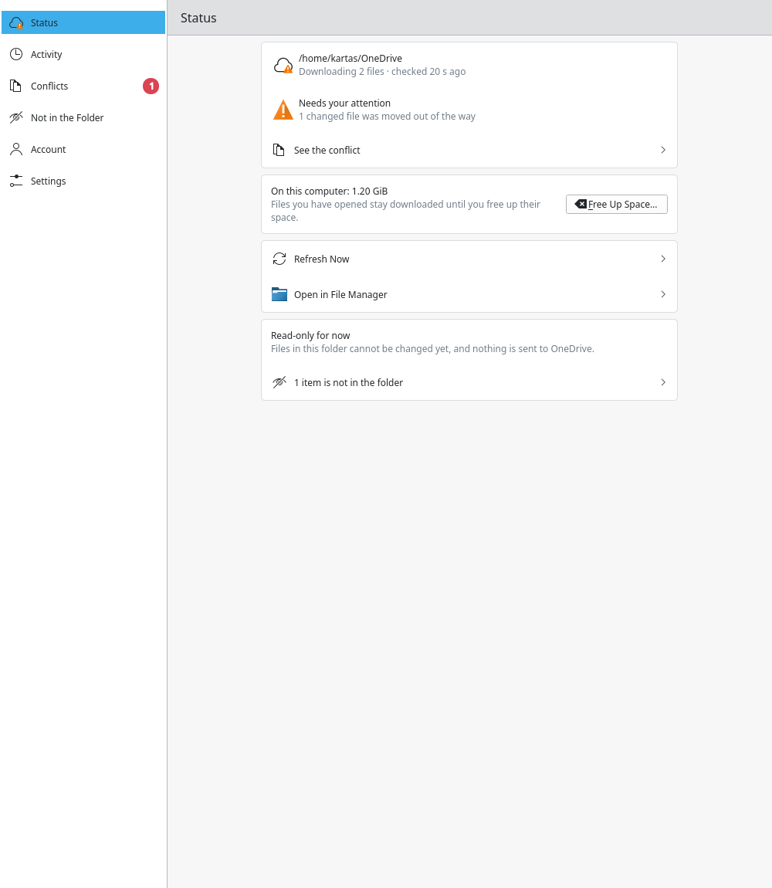
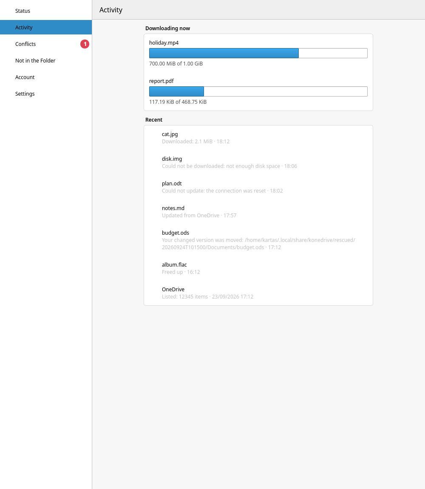
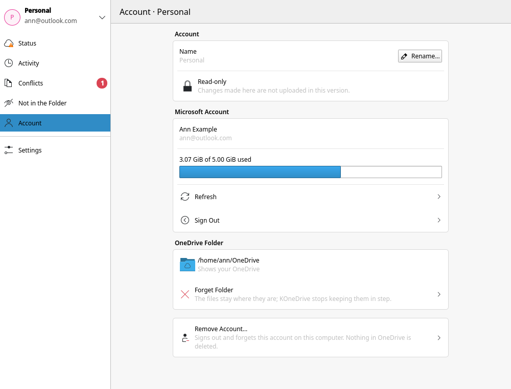

# KOneDrive

A OneDrive client for KDE Plasma on Linux, with Windows' "Files On-Demand" and no FUSE: your
OneDrive is a folder of real files at their real sizes, and a file downloads the moment something
opens it.

## Features

- **Files on demand.** Every file is there from the start and takes no space until it is opened;
  then it downloads by itself, and the program that opened it just reads it.
- **Always keep on this device** and **Free up space**, for files and folders.
- **Uploads.** What you change, move or delete in the folder goes back to OneDrive. Off until you
  turn it on, account by account; until then the folder is read-only.
- **Several accounts**, each with its own folder.
- **Nothing is lost in a conflict.** A file changed on both sides is kept twice, and listed.
- **Dolphin.** An emblem on every file — online-only, downloading, downloaded, kept — and a
  right-click menu: keep, free up, open in OneDrive's web interface. Previews of images and videos
  come from OneDrive without downloading the file.
- **A window and a tray icon** — one icon per account — with the state of each account, what is
  being transferred, recent activity, conflicts, and what could not be synced and why.
- **Pause**, for a few hours or until resumed; and by itself on a metered connection or on battery,
  if you want.
- **Notifications and progress** in Plasma, and an entry per account in Places.
- **Everything from the command line too**: `konedrivectl` does whatever the window does.
- **Little runs as root.** A small helper intercepts the opens; it has no network and no
  credentials. Everything else runs as you.

## Screenshots

| Status | Activity | Account |
| --- | --- | --- |
|  |  |  |

(Shown with example data from a test daemon, not a real OneDrive account: two accounts,
"Personal" chosen in the switcher at the top of the sidebar.)

## Status

Alpha. Built for Fedora 44 and 45 with KDE Plasma 6. Personal Microsoft accounts only; work and
school accounts are not supported yet.

## Install

Needs Linux 6.0 or later (6.14 for exact error messages when a download fails), KDE Plasma 6, Qt
6.8+ and KDE Frameworks 6.8+.

Download the two RPMs of the latest release for your Fedora (`.fc44` or `.fc45` in the name) from
the Releases page — `konedrive` and `konedrive-kde` (the Dolphin plugins), not the `.src.rpm` — and
install them:

```
sudo dnf install ./konedrive-*.rpm
```

Then open **KOneDrive** from the launcher, sign in and choose an empty folder. There is no package
repository yet. Upgrading, removing and the details: [the user guide](docs/user-guide.md).

## How it works

```
   fanotify pre-content events                  D-Bus (org.konedrive.*)
┌───────────────────┐   permission events   ┌───────────────┐   status, actions   ┌──────────┐
│ konedrive-helper   │ ───────────────────► │ konedrived     │ ──────────────────► │ KOneDrive│
│ (root, tiny)       │ ◄─────────────────── │ (your user)    │ ◄────────────────── │ window   │
└───────────────────┘    fill/allow/deny    └───────────────┘                     └──────────┘
```

- **The helper** (`konedrive-helper`) is the only part that runs as root, and is kept small. It
  uses the kernel's fanotify pre-content events to suspend an open of a file that is not
  downloaded yet, and hands it to the daemon.
- **The daemon** (`konedrived`) runs as you. It talks to Microsoft Graph, keeps the local index,
  fills the file the helper asked about, uploads your changes, and serves the D-Bus API.
- **The window** (`konedrive`) and `konedrivectl` only talk to the daemon; closing the window does
  not stop syncing.

## Documentation

- [User guide](docs/user-guide.md) — installing, the first steps, the window, the tray, Dolphin,
  uploading, troubleshooting.
- [Command line](docs/command-line.md) — the same with `konedrivectl`.
- [Design](docs/design/README.md) — how the pieces fit together and why.
- [Limitations](docs/limitations/README.md) — what does not work and cannot simply be fixed. Read
  it before filing a bug.
- [Developing](docs/developing.md) and [CONTRIBUTING.md](CONTRIBUTING.md) — building, a
  development install, the tests, the checklist for a change.
- [SECURITY.md](SECURITY.md) — what runs as root, what it can do, and how to report a
  vulnerability privately.

## Roadmap

1. A package repository (COPR), so that `dnf install` and `dnf upgrade` find the packages.
2. Work and school accounts (Microsoft 365, OneDrive for Business).

## License

GNU General Public License, version 3 or later (GPL-3.0-or-later). See [LICENSE](LICENSE).
